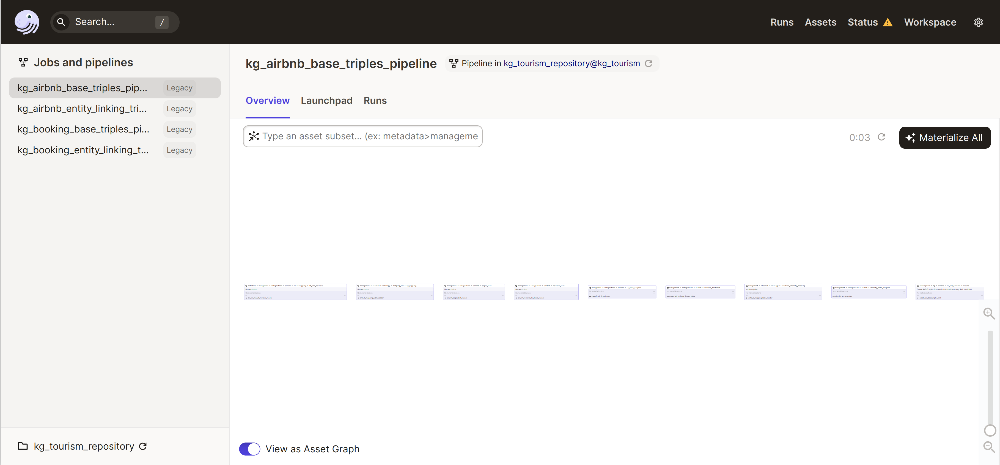
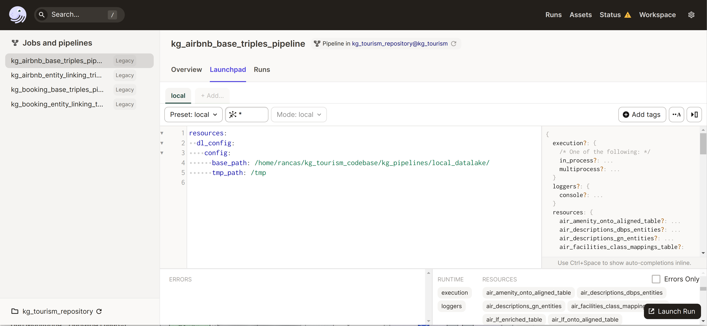

# Installation


Tested with Python 3.8 (it should also work with versions 3.6 and 3.7).
Create and activate a Python virtual environment:
```python
#create the virtual environment in the env folder under the project root
python -m venv env
#actrivate the environment
source ./env/bin/activate
```
We can now install the prerequisite packages, the kg_tourism local package and download spacy language package:

We have to install the required pyhon modules and then the repository code as a local python package:
**Note: during installation you should see an error like "ERROR: mordecai 2.1.0 has requirement spacy<3.0,>=2.3, but you'll have spacy 3.2.1 which is incompatible.". It is fine to have it because spacy now supports back.compatibility with version 2.x.**
**Note: during installation you should also see an error like "ERROR: boto3 1.21.19 has requirement botocore<1.25.0,>=1.24.19, but you'll have botocore 1.23.24 which is incompatible.". It is fine because we are not usin boto.**

```python
pip install wheel
pip install -r requirements.txt ## install required modules
pip install -e . ## install local repository code
python -m spacy download en_core_web_lg ## download spacy language model for english
pip install mordecai==2.1.0 --no-deps
```

To recreate the basic filesystem structure and the input files necessary to run the pipelines you can use the local_datalake.tar.gz file to create a scheleton (no booking.com or AirBnB data is included but only lookup tables).
To download a little data set to run the pipelines you can download the archive [swj-paper2022-data.tar.gz](http://tourism.documentation.linkalab-cloud.com/swj-paper2022-data.tar.gz).
Now you have to extract the archive inside the integration directory:
```
## We suppose you setup the project directory
tar -xvzf local_datalake.tar.gz
wget http://tourism.documentation.linkalab-cloud.com/swj-paper2022-data.tar.gz
tar -xvzf swj-paper2022-data.tar.gz -C local_datalake/management/integration/
```

To get the java RML mapper jar file:
```bash
cd local_datalake/code/
sh get_mapper.sh
```

We have to ensure that Java 11.x or higher is installed in the system. For Ubuntu 20.04:
```
sudo apt install default-jre
```

Now we can prepare dagster home directory:
```bash
export DAGSTER_HOME=$PWD/dagster_home_kg/ ## change to whatever location you prefere
cp workspace.yaml $DAGSTER_HOME
```

## Prerequisites for GeoNames entity linking
The entity linking against GeoNames is performed using [Mordecai](https://github.com/openeventdata/mordecai).

In order to work Mordecai needs to have access to a GeoNames gazetteer exposed using [ElasticSearch](https://www.elastic.co/elastic-stack/).

You can find the installation instruction from [Mordecai ReadMe](https://github.com/openeventdata/mordecai#installation-and-requirements) following just step 3.


##Running the pipelines for KG creation
Finally to execute dagster:
```
export DAGSTER_HOME=$PWD/dagster_home_kg/ ## use the correct location for you
export DATALAKE_PATH=$PWD/local_datalake/ ## use the correct location for you
cd $DAGSTER_HOME
dagit -p 3333
```
The open the web console on the browser at url http://127.0.0.1:3333

You should see the following dashboard:


To execute the pipeline we must first select it in the "Jobs & Pipelines" panel on the left the pipeline to execute.
Then in the pipeline control dashboard select the "Launchpad" tab. The default parametes are already configured the "New run" tab.



To run the pipeline click on *"Launch Run"* button in the right bottom corner.

You can execute the pipelines in whatever order you prefere and even more than one at a time. To extend the paralelism of Dagster you should adjust the [software deployment](https://docs.dagster.io/deployment/overview) using a more advanced setup.


### License ###

This project is licensed under the Apache License 2.0.

See [LICENSE](LICENSE.txt) for more information.

This is a project created by [Linkalab](http://www.linkalab.it) in collaboration with the [Department of Mathematics and Computer science of the University of Cagliari](https://unica.it/unica/en/dip_matinfo.page) and [Knowledge Media Institute of The Open University](https://kmi.open.ac.uk/).